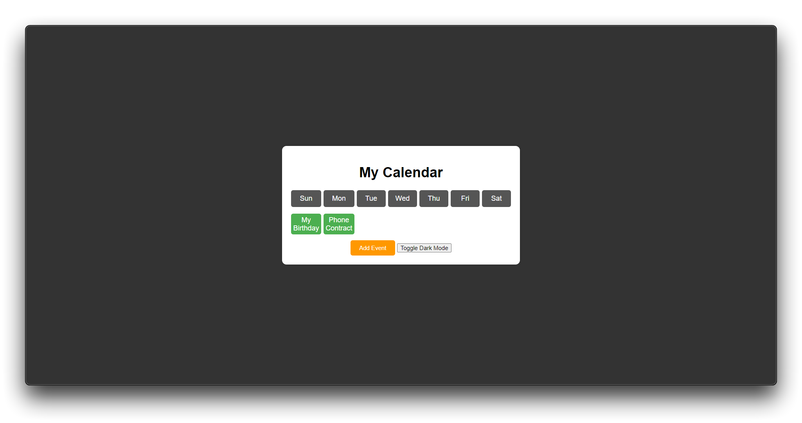

# Calendar Application

This is a simple calendar application built using HTML, CSS, and JavaScript. The application allows users to organize their daily life by adding, editing, and deleting events. It also features a dark mode and local storage to persist events even after the browser is closed.

## Features

- **Create Event:** Users can add events by selecting a date and entering the event name.
- **Edit Event:** Events can be edited by clicking on them in the calendar.
- **Delete Event:** Users can delete events during the edit mode.
- **Dark Mode:** Switch between light and dark themes to suit your preference.
- **Local Storage:** All events are saved in local storage, so they remain even if you refresh or close the browser.
- **Drag and Drop:** Users can drag events between different dates.

## Screenshots

### Light Mode


### Dark Mode


## Installation

To run this application locally:

1. **Clone the repository:**
   ```bash
   git clone https://github.com/regulating/calendar-app.git
   cd calendar-app
   ```

2. **Open `index.html` in your browser:**
   Simply double-click the `index.html` file or use a live server extension if you are using VS Code.

## Usage

1. **Add an Event:**
   - Click the "Add Event" button.
   - Enter the event name and select a date.
   - Click "Save Event."

2. **Edit/Delete an Event:**
   - Click on an event in the calendar.
   - Edit the event details or delete it.

3. **Switch Theme:**
   - Click the "Toggle Dark Mode" button to switch between light and dark themes.

4. **Drag and Drop:**
   - Drag events between different dates by clicking and dragging the event boxes.

## Contributing

Feel free to contribute to this project by opening issues or submitting pull requests. Any contributions are welcome!

## License

This project is licensed under the MIT License - see the [LICENSE](LICENSE) file for details.